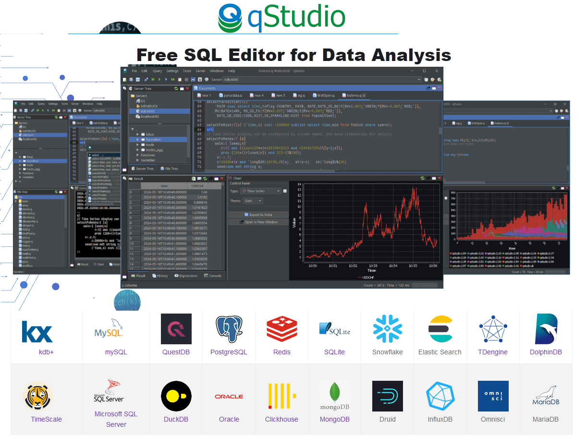
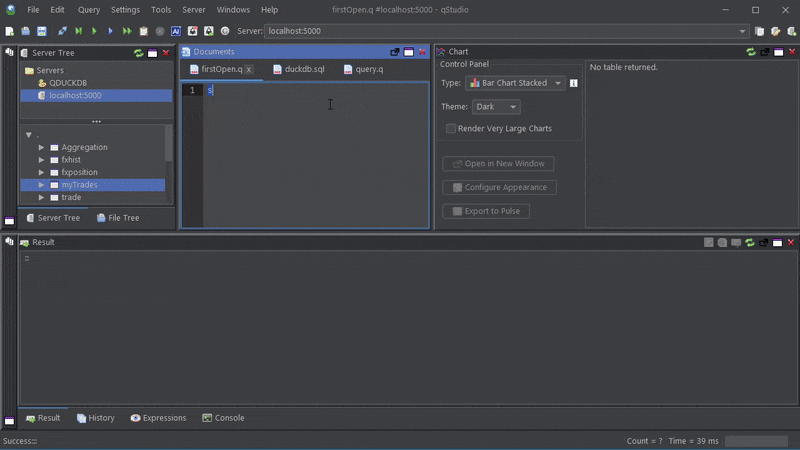
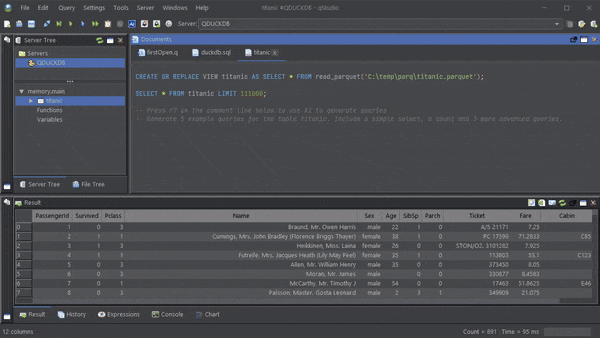

# qStudio - Free SQL Analysis Tool

**qStudio is a free SQL GUI** that lets you browse tables,
run SQL scripts, and chart and export the results.
qStudio runs on Windows, macOS and Linux, and works with
every popular database including mysql, postgresql, mssql, kdb…
For more info see [timestored.com/qstudio](http://timestored.com/qstudio "timestored.com/qstudio")

## Runs on everything

Windows, macOS, Linux

## Suports Every Database

kdb+, mySQL, QuestDB, PostgreSQL, Redis
TimeScale, Microsoft SQL Server, H2 Database, DuckDB, Oracle
TDengine, DolphinDB, Clickhouse, MongoDB, Druid, InfluxDB
Derby, HSQLDB, SQLite, CSV, MS Access, JDBC
Apache Calcite Avatica, Snowflake, Elastic Search, MariaDB, Apache Kylin, DB2, 
Teradata, CrateDB, NuoDB, SAP HANA, Gemfire XD, Snappy Data Tibco
Spark Hive, Kyubi Hive, Yandex Clickhouse, Neo4J, Presto, Trino
Apache Solr, Apache Ignite, Omnisci, Informix, Sqream, Aurora

## Features

 * **Server Browser** - Browse a server as a tree of objects with useful common tasks available from drop down menus.
 * **Built-in Charts** - Simply send the query you want and select the chart type wanted to draw a chart. 
 * **Syntax Highlighting**
 * **Code Completion**

 
### Pivot and Chart Data Easily
 

### Powerful AI Assistant

*   **[Text2SQL](https://www.timestored.com/qstudio/help/ai-text2sql)** - Generates queries from plain English.
*   **[Explain-My-Query](https://www.timestored.com/qstudio/help/ai-explain-sql)** - Walks you through your code.
*   **[Explain-My-Error](https://www.timestored.com/qstudio/help/ai-sql-assistant)** - Ask AI why your code throw an error.

## Current Status

Check out the [CHANGELOG.md](./CHANGELOG.md) file for the latest information.

## Troubleshooting qStudio

Check the [Troubleshooting](./TROUBLESHOOTING.md) for more information.

""  
""  
""  
""  
""  
""  
""  
""  
""  
""  
""  
""  
""  
""  
""  
""  
""  
""  
""  
""  
""  
""  
""  
""  
""  
""  
""  
""  
""  
""  
""  
""  
""  
""  
""  
""  
""  
""  
""  
""  
""  
""  
""  
""  
""  
""  
""  
""  
""  
""  
""  
""  
""  
""  
""  
""  
""  
""  
""  
""  
""  
""  
""  
""  
""  
""  
""  
""  
""  
""  
""  
""  
""  
""  
""  
""  
""  
""  
""  
""  
""  
""  
""  
""  
""  
""  
""  
""  
""  
""  
""  
""  
""  
""  
""  
""  
""  
""  
""  
""  
""  
""  
""  
""  
""  
""  
""  
""  
""  
""  
""  
""  
""  
""  
""  
""  
""  
""  
""  
""  
""  
""  
""  
""  
""  
""  
""  
""  
""  
""  
""  
""  
""  
""  
""  
""  
""  
""  
""  
""  
""  
""  
""  
""  
""  
""  
""  
""  
""  
""  
""  
""  
""  
""  
""  
""  
""  
""  
""  
""  
""  
""  
""  
""  
""  
""  
""  
""  
""  
""  
""  
""  
""  
""  
""  
""  
""  
""  
""  
""  
""  
""  
""  
""  
""  
""  
""  
""  
""  
""  
""  
""  
""  
""  
""  
""  
""  
""  
""  
""  
""  
""  
""  
""  
""  
""  
""  
""  
""  
""  
""  
""  
""  
""  
""  
""  
""  
""  
""  
""  
""  
""  
""  
""  
""  
""  
""  
""  
""  
""  
""  
""  
""  
""  
""  
""  
""  
""  
""  
""  
""  
""  
""  
""  
""  
""  
""  
""  
""  
""  
""  
""  
""  
""  
""  
""  
""  
""  
""  
""  
""  
""  
